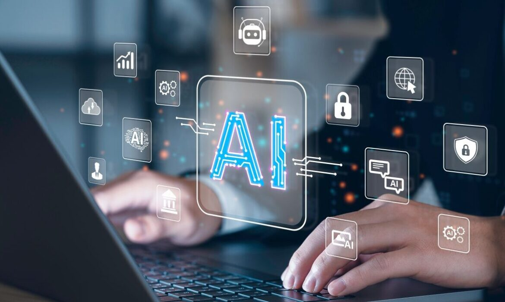

## Introduction

In the realm of Software Engineering, Artificial Intelligence tools play a pivotal role in enhancing development, problem-solving, and efficiency. I believe that my use of AI tools has been beneficial to my development as a Software Engineer. Tools like ChatGPT and Co-Pilot have deeply helped me improve my understanding and application of software engineering principles. Though some may argue that AI tools are taking away from the authenticity of software engineering, I believe that AI tools are a powerful asset that can be used to enhance the quality of software engineering.

## Personal Experience with AI 
### Experience WODs

The experience WODs were a great way to get an idea of how long it takes me to complete different tasks. I was able to get a better understanding of my strengths and weaknesses as a software engineer and discover areas of improvement. However, throughout this semester, I can't say that I have used AI tools to complete experience WODs, and if I have, it was once or twice. I believe that the experience WODs are a great way to practice and improve my skills as a software engineer, but due to the flexibility of multiple attempts, I didn't feel the need to use AI tools. I wanted to challenge myself and complete the WODs without the help of AI tools.

### In-class Practice WODs

Typically, for in-class WODs, students would be assigned to work with a partner. I found this opportunity to be very beneficial because it allowed me to work with other students and learn from them. It was an enlightening experience to view the different approaches students took to solve the same problem. I did not use AI tools for in-class WODs because I found it more enjoying and beneficial to figure out the problem on my own or with the help of my peers.

### In-class WODs

Though the time limit for in-class WODs was a bit challenging, I found the experience to be very rewarding. Practice WODs were a great way to familiarize myself with the expected WOD prompts and get a better feel of the time limit. I did not use AI tools for in-class WODs because I wanted to challenge myself and see how much I could accomplish in the given time limit. I also wanted to get a better understanding of my strengths and weaknesses as a software engineer. I can only recall on one occasion where I used AI tools for an in-class WOD, and it was because I had misunderstood the prompt and was cutting it close to the time limit. I ended up using AI tools to help me complete the WOD on time with reference to my code that I had previously written. The end result/code was ultimately pretty similar to the code I had already written.

### Essays

Compared to WODs, I found essays to be a more suitable opportunity to use AI tools. I believe that AI tools are a great way to enhance the quality of essays and help students improve their writing skills. I have used AI tools for a handful of essays, and I found them to be very helpful. For instance, I use AI tools to help me with my sentence structure, like rephrasing certain concepts to be more comprehensible. I have also referred to AI tools to help me with my word choice and vocabulary. Even now, I am using AI tools to help me with my sentence structures in this essay. I believe that AI tools can be utilized in a way of enhancing the quality of essays and helping students improve their writing skills, whilst still maintaining the integrity and authenticity of the essay. 

### Final project

To complete my final project, I have not used AI tools. I don't think I plan on using AI tools for my final project because I want to see how much my team and I can accomplish on our own. I believe AI tools are ultimately great learning tools, but it is important to examine how much we can accomplish without the assistance of AI assistance.

### Learning a concept / tutorial

AI tools have been extremely useful when learning new concepts. I have used AI tools to help me understand concepts that I have a hard time understanding. For instance, I have used AI tools to help me understand the concepts of scripts in our projects with Meteor and React. To prepare for the Meteor Quiz earlier this semester, I referred to ChatGPT to help me understand which files were utilized during the build process (e.g. 'meteor npm install' and 'meteor npm run start'). I believe that AI tools are a great way to enhance learning experiences and help students get a deeper understanding of concepts that they are unfamiliar with.

### Answering a question in class or in Discord

I have not utilized AI tools to answer questions in class or in Discord. I like to listen to other students' answers and learn from them. I believe that AI tools are a great way to help students get a deeper understanding of concepts that they are unfamiliar with, however, I believe that students should also be able to answer questions on their own and not rely on AI tools to answer questions for them. This would prepare students for real-world scenarios like interviews, where they would have to demonstrate their skills without access to AI tools.

### Asking or answering a smart-question

Though I used ChatGPT to help me with the structure of my essay on Smart Questions, I did not use AI tools to ask or answer Smart Questions. I suppose that if learning unfamiliar concepts fall under the term of Smart Questions, then I have used AI tools to ask Smart Questions. However, I don't believe I have used AI tools to answer Smart Questions. 

### Coding example

As mentioned above, I believe this falls under the concept of using AI tools to grasp a deeper understanding of concepts that I am unfamiliar with. I believe that seeing examples similar to the problem you are having helps you get a better understanding of the general concept. For instance, when we were learning about the UnderScore library, I used AI tools to help me understand some Underscore functions, such as _.map and _.pluck. I would ask GhatGPT to give me an example of using _.map or _.pluck, and it would give me an example of how to use the function, inspiring me to apply it to my own situation OR how it can be generally used. This was especially helpful because we only had a couple of days to learn the Underscore library and be examined on it.

### Explaining code

ChatGPT has been very helpful in providing explanations for code. I have used ChatGPT to help me understand the code it has written for me to understand its way of thinking. I have found that this method exposes me to different approaches and different time complexities, data structures, algorithms, etc. AI tools help me get a better understanding of more efficient code and how it works. For instance, Co-pilot has helped me how arrays can be most favorable for some situations, and linked lists can be most favorable for other situations.

### Writing code

Sometimes when the code AI tools write is more efficient than mine, I will adapt the concepts (data structures and algorithms) it used into my code. I usually like to write code from scratch, but if I am having a hard time figuring out how to approach a problem, I will refer to AI tools to help me get started. For example, I was confused on the instructions for the Javascript 2 WOD, so after the time limit was up, I referred to ChatGPT to help me understand the instructions. I found that ChatGPT was able to explain the instructions in a way that was more comprehensible to me. 

### Documenting code

Documenting code, or commenting in code is a very important aspect of software engineering. I believe the process of reflecting on your code and commenting it is a great way to ensure a deeper understanding of the code. However, sometimes, when I get too close to a deadline, I find myself utilizing Co-pilot to help me comment my code. Co-pilot has been very helpful in providing explanations for code. I have used Co-pilot to help me understand the code I have written.

For instance, I have used ChatGPT to help me understand how to properly comment my code in Javascript. I have also used ChatGPT to help me understand how to properly comment my code in HTML and CSS. I found that ChatGPT was able to explain the syntax in a way that was more comprehensible to me. Without AI tools, I would have had a hard time understanding how to properly comment my code.

### Quality assurance

I found myself using ChatGPT quite often at the beginning of the semester. It was my first time writing HTML and CSS, so I was unfamiliar with the syntax. I would use ChatGPT to help me understand the syntax and how to properly write HTML and CSS. I ran into many errors that I did not know how to personally fix. I found that ChatGPT was able to explain the syntax in a way that was more comprehensible to me. Without AI tools, I would have had a hard time understanding HTML and CSS, as well as fixing my errors.

## Impact on Learning and Understanding

Overall, the incorporation of AI within my learning experience has been very beneficial. It has provided me with nuanced explanations and real-time assistance that fostered a deeper understanding. ChatGPT and Co-pilot has enhanced my skill development by offering practical applications, allowing me to experiment and refine my coding and problem-solving abilities. I believe AI tools help me become a more knowledgeable software engineer.

## Practical Applications

Even outside of ICS 314, AI tools are very helpful in learning. For example, it has helped me understand different algorithms and data structures for my ICS 311 class. It provides me with resources and examples that I can use to learn and understand different concepts. ChatGPT is pretty reliable already, though over time it becomes more and more accurate. I believe it helps me find reliable information on demand and helps me learn more efficiently. For instance, I have used ChatGPT to help me understand the Big O notation of many different algorithms. I have used ChatGPT to help me compare and contrast algorithms. 

## Challenge and Opportunities

AI tools are usually pretty accurate, however sometimes they can be inaccurate. This is pretty challenging when I am relying on it to give me accurate information for assignments. I don't ever take the work of AI tools word for word, I always try to check the information it gives me and rephrase it in my own voice. For instance, I have found that its explanation for discrete math concepts is not always accurate. I remember asking ChatGPT a question on the Pigeonhole Principle, and it gave me an explanation that was not accurate. I had to do some research on my own to find the correct answer.

## Comparative Analysis

AI-enhanced approaches in software engineering education offers personalized feedback and assistance that can be tailored to the needs of each individual student. AI tools can be used to help students learn and understand concepts that they are unfamiliar with, and improve their skills in many different areas. 

Traditional teaching methods are not as personalized as AI-enhanced approaches. Traditional teaching methods use a more general approach to teaching, and some students may not be able to grasp the concepts as easily as others. AI-enhanced approaches promotes a student-led learning experience, where students can learn at their own pace and receive personalized feedback.

## Future Considerations

I believe that the use of AI in software engineering education can be very beneficial and ultimately help students become more knowledgeable software engineers. As mentioned above, AI-enhanced approaches allow students to get more help beyond the classroom and learn at their own pace. However, I can see how AI-enhanced learning can be detrimental to students' learning experiences. For instance, students may become too reliant on AI tools and not be able to answer questions on their own. This would be detrimental to students' learning experiences because they would not be able to demonstrate their skills without access to AI tools. I believe that with the right intentions and proper use, AI-enhanced approaches can be very beneficial to students' learning experiences.

## Conclusion

The integration of AI in the Software Engineering course has demonstrated its significant impact on learning, skill development, personalization, and problem-solving. I believe the integration of AI in learning is inevitable and will continue to grow in the future. By encouraging students to use AI tools and balance their AI assistance and independent thinking, students will be able to reap the benefits of AI-enhanced approaches. I believe that AI tools are a powerful asset that can be used to enhance the quality of software engineering while still maintaining the integrity it.
