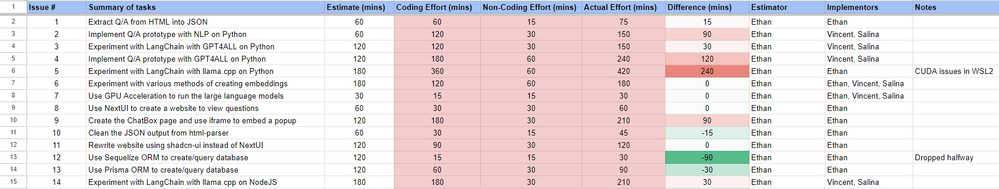

## Introduction

Effort estimation and meticulous tracking of invested time are pivotal elements in effective project management and coordination. That being said, the process of estimating and tracking project effort is not as easy as it seems. It requires a lot of time and effort to accurately estimate and track project effort. However, the benefits of effort estimation and tracking are worth the time and effort.

While my team and I were developing our UH ITS AskUs AI Chatbot, we decided to estimate and track our project effort to get a sense of how much time we were investing into the project and to ensure we were on track with our project timeline. We used a variety of tools to estimate and track our project effort, such as GitHub Projects, GitHub Issues, and Darkyen's Time Tracker. These tools helped us estimate and track our project effort, as well as keep us organized and on track with our project timeline.

I believe that our tracking was mostly accurate, as we recorded many details about the times we spent on each task. Although, there were some instances where we were unsure of the exact time we spent on a task and had to use the Time Tracker extension on IntelliJ to guide us. In addition, some of the non-coding time is not completely accurate because we were distracted by other tasks that may not have been related to the project, and did not record the time we spent on those tasks. However, I believe that our tracking was mostly accurate and that we were able to get a sense of how much time we were investing into the project.

## Procedure

In our time estimation spreadsheet, we tracked Issue Number, Issue Title or Summary of the Tasks, the Estimated Time, the Coding Effort Time, the Non-Coding Effort Time, the Actual Time (total), and the Difference Time. We also recorded the names of the individuals accountable for estimating the time and those who executed the task for each specific issue.

We used the Estimated Time to estimate how much time we thought it would take to complete a task. The Coding Effort Time represented the time we spent coding, and we used the Non-Coding Effort Time to track the time we spent on non-coding tasks, such as meetings, research, and documentation. The Actual Time was the sum of the Coding Effort time and Non-Coding Effort Time, which was used to track the total time it took to complete a task. The Difference Time was the difference of the Actual Time and Estimate Time, which tracked the difference between the time we expected to spend on a task and the time it actually took to complete the task.

## Making Effort Estimates

As shown in the image above, most of our estimated times were shorter than the actual time it took to complete a task. Initially, this was because we underestimated the time it would take to complete a task. While estimating the time it would take to complete a task, we could not predict **ALL** the time it would take to research and learn how to implement a feature. For instance, we estimated that it would take us 180 minutes to deploy our application on Google Cloud Platform, but it actually took us 438 minutes to implement the feature. That's a huge difference! This was because we did not consider the time it would take to research and learn how to implement the feature, as wel as the time it would take to troubleshoot errors and bugs.

After realizing that we were underestimating the time it would take to complete a task, we referred to our past results and attempted to reserve more time to our Estimate Times so the Difference Time would be smaller. As you move down the spreadsheet, you can see that our Estimate Times for some tasks became more accurate and our Difference Times became smaller. On other occasions, there was still a large difference between the Estimate Time and Actual Time.

### The Benefits of Effort Estimation

After experimenting with effort estimation, we realized that effort estimation brings substantial advantages to efficient project management. This practice encourages maintaining a comprehensive view of task completion within the project's schedule, which is vital in meeting deadlines and ultimately completing projects. In addition to its strong organization, it enables swift and realistic decision-making, which guides team members on whether to proceed with other tasks or assist another team member that is struggling with a prerequisite task. 

Consistent and organized monitoring of the actual effort allocated to each task offers project managers and team members real-time insights into progress. These insights not only help in evaluating project timelines but also facilitate proactive adjustments in resource allocation. By identifying patterns and refining the accuracy of future effort estimations, it significantly contributes to achievable future planning.

## Effort Tracking Data

As mentioned earlier, this data was collected during the development of the UH ITS AskUs AI Chatbot. If you would like more information about this project, please visit my [UH ITS AskUs AI Chatbot](https://salina-t.github.io/projects/askus-chatbot.html)  project page.

If you would like to view the data collected, please visit [this spreadsheet](https://docs.google.com/spreadsheets/u/1/d/e/2PACX-1vSV459Z-bALjHDeTYfD1Rsv1V8Ka8-GkHGRoEKHDCssPwa_Rf6OQA-5LJnhxRDrrI0dgazFsfa80R3V/pubhtml?gid=0&single=true).
