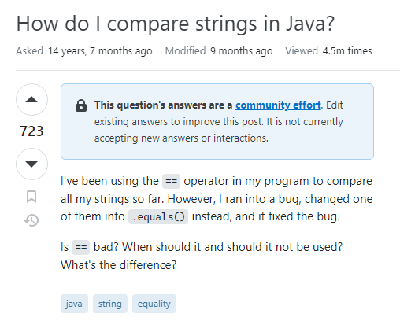

## What are Smart Questions?

"Smart Questions" as described by Eric Raymond in "How to Ask Questions the Smart Way" are questions
that are thoughtfully formulated, and rich in detail and clarity. This approach to asking questions
not only saves time but also enhances the effectiveness of communication. 

Eric Raymond's principles to asking smart questions are very advantageous to software engineers in 
several ways. They aim to build a better curriculum whilst exchanging information that reduces vagueness,
saves time for both questioners and responders, and facilitate efficient collaboration in the software 
development community.

<br/>

##  Back to the Drawing Board


Taking a look at [**this forum post**](https://stackoverflow.com/questions/69864780/when-i-run-this-code-i-get-this-error-why) on StackOverflow, there are several red flags that determine this 
as a bad question. Firstly, the title of this forum is as vague as it gets, with no context
to the user's predicament. Next, with a quick Google search of the error the user received in
verbatim, countless solutions are provided. The user posted this forum in 2021, whereas if they had
just Googled the error they received, they would've found a conceptual solution from 2009. The
conceptual answer would've been beneficial to the user as well, as they could practice applying new 
concepts to debugging their own source code. 

With the lack of written detail from the user and the only context being a snippet of their source
code, it is easy to deduce that the user was expecting someone to find the error in their code and 
spoon-feed them a solution that they can copy-and-paste into their program. 

While the user did receive a solution and response, there was no personal gain of knowledge. The user  
did not initially display curiosity in understand the underlying cause of the error; instead they 
wanted a quick fix. The solutions to this forum included both a clear explanation to the user's 
problem and a fixed solution the user could implement. However, consequently to the questioner's lack
of curiosity, if they were to encounter this error again in the future, 
they won't be able to reflect on this experience because the principle did not carry enough
significance to leave a lasting impact on them.


## A Work of Art 




Next, let's take a look at [**this forum post**](https://stackoverflow.com/questions/513832/how-do-i-compare-strings-in-java) 
that was also from StackOverflow. In this exchange, the questioner runs into a bug while comparing strings and
becomes curious about the different equal operators that are available in Java. 
At first glance, this post shows good signs by being thoughtfully written with clear, polite, and grammatically 
correct language. 

The questioner does a great job at providing potential responders with context and details. 
The questioner specifies the programming language they are using and provides ample context for readers to understand
their predicament. While the user does not include explicit source code, their question focuses more on conceptual 
aspects than operational details. This user also demonstrates that they've taken steps to solve the problem on 
their own, but they are interested in gaining insights into the different comparison operators in Java.

The user's smart question attracted smart responses from fellow computer scientists that were happy to help
and share their knowledge. The responders to this forum include a detailed explanation to each comparison 
operator in Java and when and why they would be used for different contexts. The responder also provides
the questioner with a snippet of code to give the questioner examples of each equals-comparison operator.
(As provided in the block of code below)

```java
// These two have the same value
new String("test").equals("test") // --> true 

// ... but they are not the same object
new String("test") == "test" // --> false 

// ... neither are these
new String("test") == new String("test") // --> false 

// ... but these are because literals are interned by 
// the compiler and thus refer to the same object
"test" == "test" // --> true 

// ... string literals are concatenated by the compiler
// and the results are interned.
"test" == "te" + "st" // --> true

// ... but you should really just call Objects.equals()
Objects.equals("test", new String("test")) // --> true
Objects.equals(null, "test") // --> false
Objects.equals(null, null) // --> true
```

## The Impact of Smart Questions

In conclusion, asking smart questions is a fundamental skill 
that benefits individuals seeking assistance and/or insight and 
also contributes to the general effectiveness of communication
and problem-solving within the computer science community.

Smart questions are thoughtfully formulated with detail and clarity,
making it easy for responders to understand the various factors
that need to considered when debugging or providing advice.

This experience has taught me importance and advantages of practicing asking smart questions. 
Asking smart questions saves time for both questioners and responders, 
making problem-solving concise and efficient. Embracing the principles of smart questioning will lead to 
productive interactions that ultimately enhance our community's ability to learn, 
solve problems, and grow as programmers. 