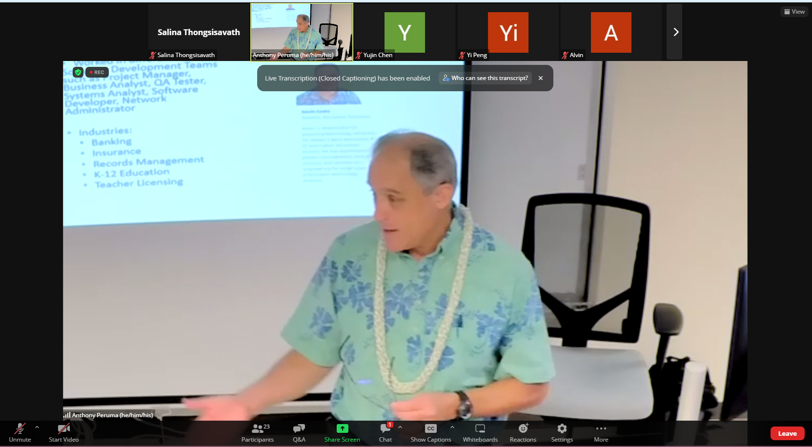

## Initial Thoughts 

When I attended Kevin Costa's Tech Industry Guest Talk, I initially thought I would learn about the technical
side of software engineering. However, much to my pleasant surprise, Costa's talk revolved mostly around the 
crucial non-programming skills for effective teamwork and communication within the field. 

## Commenting Code 

Before jumping into the non-programming skills, one technical point that stuck out to me was
commenting code. Of course, I had recognized the significance of commenting code *way* before Costa
had mentioned it, but the way Costa had explained it made me rediscover the upmost significance 
of writing clear and concise comments. 

Often times, programmers will work with a variety of people. People who have their own unique style of coding,
no background in coding, etc. All of these scenarios just make the value of 
comments in code more fundamental. Writing well-written comments can save time and effort as 
programmers will not have to spend a prolonged period of time to understand the code they--or someone else
wrote months or years ago. This makes the process of updating a program or debugging a program much quicker.

Additionally, after creating a program for employees to use in a company, programmers must create a 
technical document that explains the functions of the program so that it can be used effectively by
their co-workers. This document then becomes a part of the company library that incoming employees will visit.
Well written documents will evade confusion and mistakes. 

## Respectful and Realistic Communication
As important as it is to be a proficient programmer and have a strong understanding of computer science 
principles, it is also essential to be a team player and be open-minded. Collaborative work is 
predominant in a work environment, so it is important to actively listen to other team members when 
discussing. Besides, many minds is better than one! 

Another key point that stuck out to me was setting achievable deadlines and goals. Acknowledging 
problems and realistically creating a timeline to produce the best product is essential 
when working solo and in a team. Creating a quality output is much more valuable than creating 
a buggy product in a short amount of time. 

## Celebrating Successes!

Another central point that Costa made was celebrating successes. Often times, people may 
get so fixated in completing a large end goal that it is easy to disregard the small victories.
Just because the main goal has not been completed does not mean that there is no progress being
made! People will work better when they are in have a healthy and optimistic mindset, whereas 
negative thoughts can prevent maximal productivity and make it easy for mistakes to slip by. 

