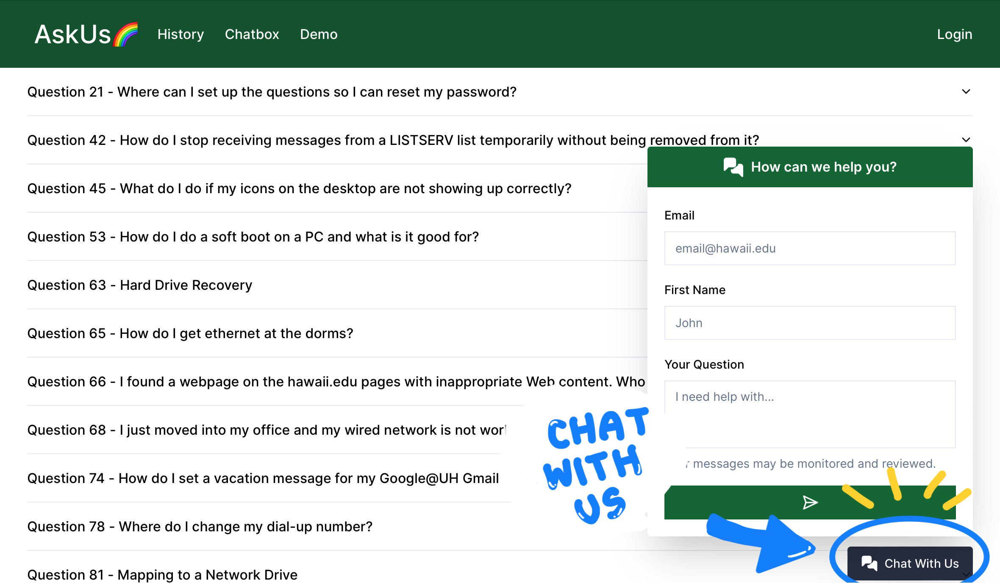
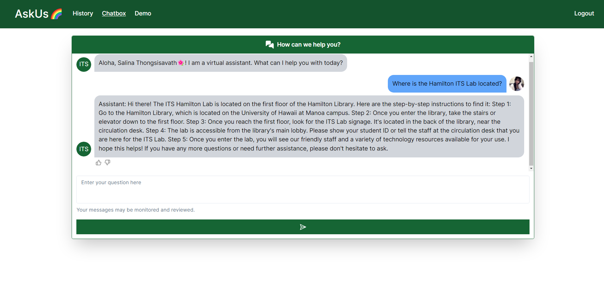
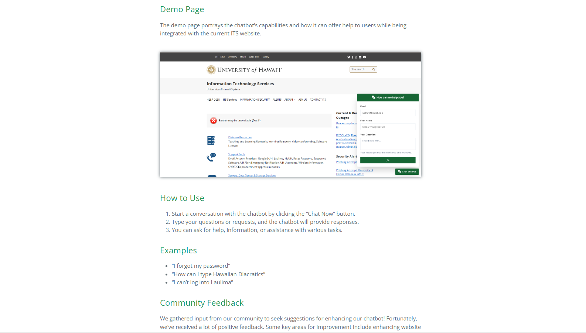
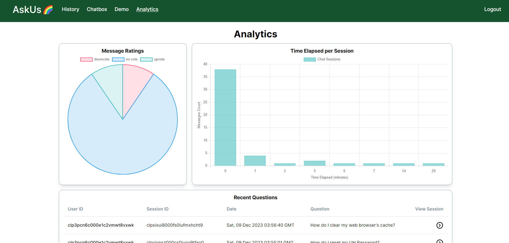

## About the Project

My team and I developed the UH ITS AskUs AI Chatbot as part of the 2023 Hawaii Annual Code Challenge (HACC). The current UH ITS AskUs system relies on keyword searches which is not as time efficient or user-friendly. To enhance this process, my team and I decided to help the UH ITS AskUs to transition from keyword searches to employing a conversational AI chatbot trained on the ITS knowledge base. 

The goal of this project is to elevate user satisfaction, reduce workloads, and optimize support procedures by introducing a more user-friendly interface. The chatbot is able to answer questions about the ITS knowledge base, as well as provide users with a rating system to provide user insights (i.e. discover areas of improvement).

The UH ITS AskUS Chatbot was built using a blend of TypeScript, Python, Javascript, HTML, and CSS programming languages.

## My Contributions to the Project

My focus in this project was to develop the frontend of the chatbot. I was responsible for creating the user interface and integrating the AI chatbot with the frontend.

In addition to the user interface, I also created our project's website that provides users with information about our project and the chatbot. It includes an overview of the project, features, user guides, developer guides, and more. The user guide provides users with instructions on how to use the chatbot and the developer guide provides developers with instructions on how to install and run the chatbot.

I also gathered user feedback and conducted acceptance testing to ensure the chatbot was functioning properly and meeting the expectations of our users. After gather user insights, I shared the results with my team, and we worked together to refine the chatbot and improve the user experience.

One noteable feature my team and I implemented was the admin analytics system. This system allows administrators to view user feedback and insights, as well as view the chatbot's performance. This feature was implemented to help administrators improve the chatbot and user experience.

## Challenges and Rewards

My experience with AI and collaborative projects has been both challenging and rewarding. I have learned a lot about the process of developing an AI chatbot and the challenges that come with it. As it was my first time working with AI, I had to learn a lot about the process of training and implementing an AI chatbot, as well as the different tools and technologies involved. There was a lot of research done for this project, but it was a fantastic experience that expanded my knowledge as a software engineer.

### Locally Hosted LLM vs Cloud-Hosted LLM
Our team's biggest obstacle was opting to implement a locally hosted large language model (LLM) instead of a cloud-hosted LLM like OpenAI. This decision was made to ensure the privacy and security of our users' data. However, this decision came with its own set of challenges.

Our decision for a locally hosted LLM meant that we had to train our own LLM. This process was time-consuming and required a lot of resources. Admittedly, we underestimated the amount of time and resources needed to train our own LLM.  Unfortunately, our solution encountered problems like generating inaccurate information, repeating user prompts, and unpredictably transitioning from offering responses to asking questions. As a result, we had to make some adjustments to our project timeline and scope. To improve the accuracy of our chatbot, we had to experiment with settings such as the prompt, temperature, etc.

### Deployment

Another issue our team ran into from running our project on a locally hosted large language model (LLM) was deploying our project. Local servers with machine learning-capable GPUs were essential to this project--but were not available on Digital Ocean. As a result, we ran our project on Google Cloud Platform to host both our website and the LLM.

## Project Links

You can learn more about our project by exploring these links!
 
 

Our GitHub repository link: [https://github.com/bruhgroup/its-knowledge-base](https://github.com/bruhgroup/its-knowledge-base)

Our project is deployed here! [https://its.monkes.net/](https://its.monkes.net/)

Our project website with the project overview, user guides, developer guides, and more: [https://bruhgroup.github.io/](https://bruhgroup.github.io/)
