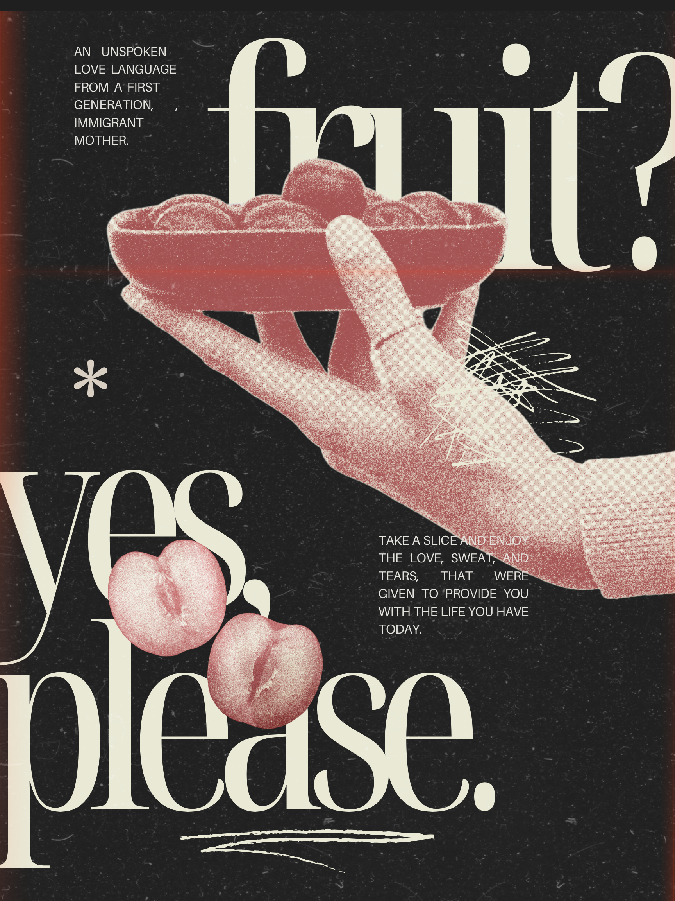

The following designs were created using Canva. These designs showcase my skills in creating visually appealing and engaging graphics for various purposes, such as infographics, posters, social media graphics, and presentations. Experimenting with different styles of graphic design has helped me understand the importance of creating aesthetic designs that are engaging and informative.

 "The Aloha State" Poster; Utilized in a project and presentation centering on tourism in Hawaii. This poster was used as the cover page of my presentation. (2022) 

 "Unspoken Love" Poster; While creating this poster, I wanted to experiment with a different kind of style and aesthetic than I usually tend to do. This theme reminds me of my mother. (2024) 

 "Luau" Poster; This poster was created to be an element in the "Aloha State" project that centered around tourism in Hawaii. This poster acts as an infographic for the popular tourist attraction, Paradise Cove Luaus. This was named the best hawaiian expereience for tourists. (2022) 

 "The Importance of Getting Vaccinated"; This infographic was created to inform the public about the significance of getting vaccinated. The infographic was shared on social media platforms to raise awareness about the COVID-19 vaccine. (2022) 

