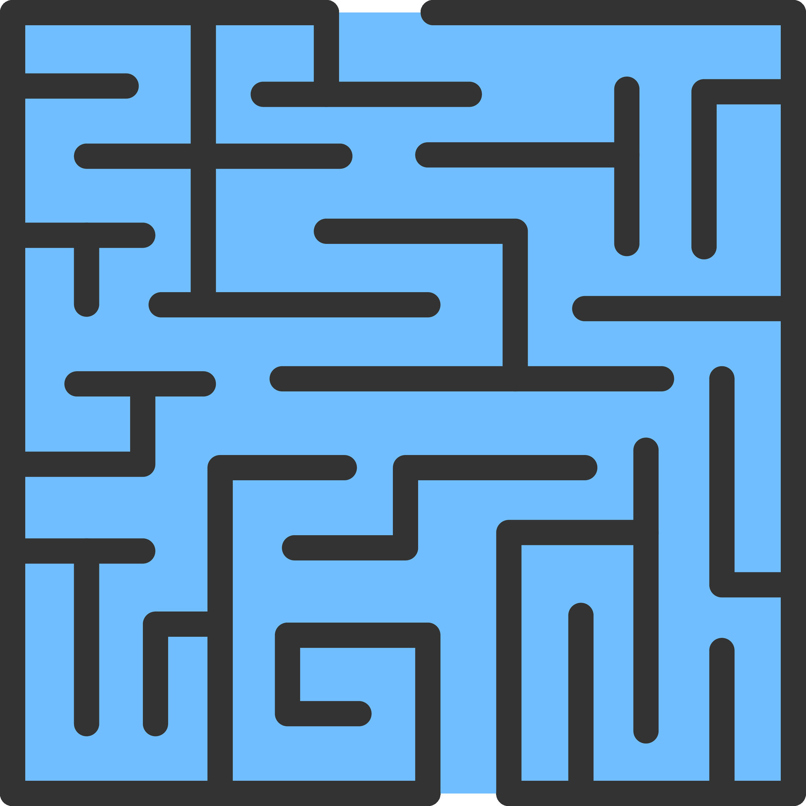

<div class="text-center p-4">

</div>

## About the Project
Maze Runner is an adventurous role-playing game that I created as a solo project in my high school AP Computer Science 
A course (2022). The project helped me learn how to design and implement a responsive and dynamic game using Java 
programming. 

Beyond my technical skills, this project also helped me explore my creativity and encouraged me to bring my ideas 
to life through code. Whilst creating this project, my love for programming became more intense as I realized the 
power of coding. I could transform abstract concepts into interactive and engaging experiences.

Within the realms of Maze Runner, there are a variety of character classes that are unique to one another. All
character types have different health, strengths, and defense skills. By default, there is a selection of different 
maps offered in Maze Runner, while also offering the option for players to introduce new maps. Additionally, the 
inclusion of boosts introduces more elements of unpredictability, as the boosts increase a randomized character's statistic 
that can increase the player's strength, health, or defense.  


## Takeaways: Skills and Concepts
This project helped me develop a strong understanding in essential programming concepts such as polymorphism, inheritance,
file handling (both reading and writing), as well as mapping values to construct a dynamic and functional game map.
Through the experience of creating Maze Runner, I not only acquired a deeper understanding of fundamental programming
principles but also practiced the ability to apply them effectively. 

## Here is a sample of what Maze Runner looks like:
```
╔══════════《✧》═════════╗
          WELCOME.		 
╚══════════《✧》═════════╝

Your mission is to kill 2 enemy entities. There will be one enemy in each map.
═══════《KEY》═══════
X = Wall
C = Player (You)
E = Enemy
✧ = Boost that increases player's statistics
✿ = Exit door to new map


Your character's statistics:
Health: 25
Strength: 22
Defense: 15

X X X X X
X ✧   X X
X   C   X
X X X   X
X       X
X E   X X
X   X X X

What direction would you like to move? WASD
d
X X X X X
X ✧   X X
X     C X
X X X   X
X       X
X E   X X
X   X X X
```


You can learn more at my GitHub link [here](https://github.com/salina-t/Maze-Runner).
