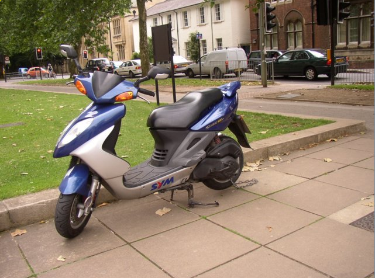
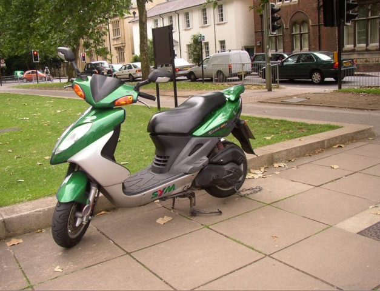
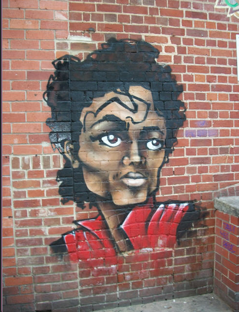
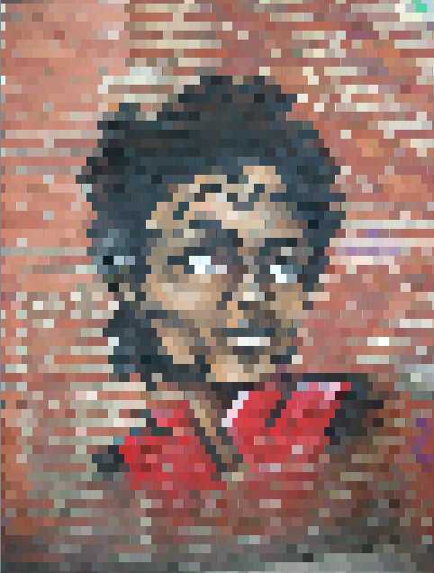
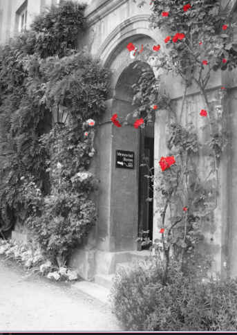

<div class="text-center p-4">
  
  
</div>

PhotoLab is a project I created in my AP Computer Science A class in 2022. This project explored the concept of using Java code to create filters 
for photos by adjusting RGB (red, green, blue) values of pixels that make up a photo. 

This was a solo project that followed a set of standards describing the expected outcome, though students were responsible for 
programming code to reach the desired outcome.

PhotoLab encouraged me to think about photos in terms of purely pixels with numeric RGB values and an X and Y axis. This project
helped me gain more experience in converting hex to decimal numbers and thinking about photo filters from a more intense and mathematical 
point of view. 

Here is some code and photos from photoLab:

``` 
public void pixelate() {
    Pixel[][] pix = this.getPixels2D();
    int counter = 0;
    int red = 0;
    int green = 0;
    int blue = 0;

    //loop through entire image with row major
    for (int r = 0; r < pix.length; r++) {
         for (int c = 0; c < pix[r].length; c++) {
         //saving the values of RGB to create seemly bigger pixels; grouping 10 pixels into 1
            if (r % 10 == 0) {
                if (counter == 0) {
                    red = pix[r][c].getRed();
                    green =  pix[r][c].getGreen();
                    blue = pix[r][c].getBlue();
                }
                // after 10 long pixels, the counter for pixels restart
                if (counter == 11) {
                    counter = 0;
                // setting the other pixels to the saved values above
                } else {
                  pix[r][c].setRed(red);
                  pix[r][c].setGreen(green);
                  pix[r][c].setBlue(blue);
                  counter++;
                }
            // if the row value is not a number divisible by 10, set the RGB values to the same RGB values in the row above it
            } else {
              pix[r][c].setRed(pix[r-1][c].getRed());
              pix[r][c].setGreen(pix[r-1][c].getGreen());
              pix[r][c].setBlue(pix[r-1][c].getBlue());
            }
         }
    }
}
 ```



More examples:





You can learn more at my GitHub link [here](https://github.com/salina-t/photoLab).
