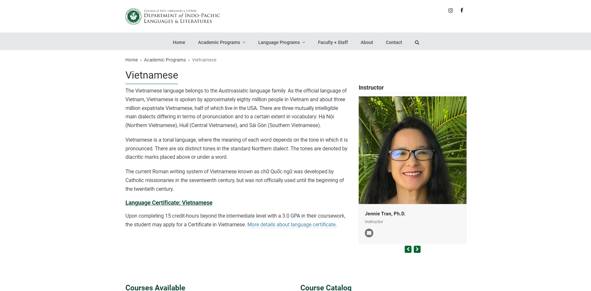
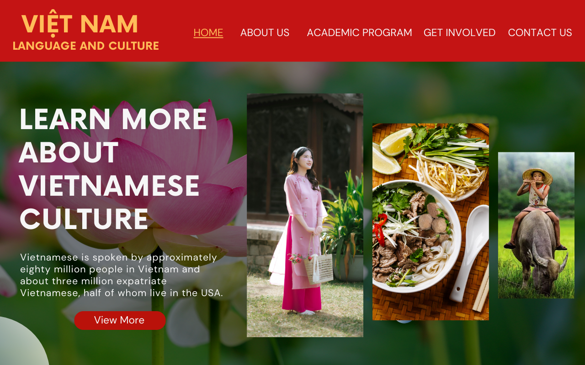
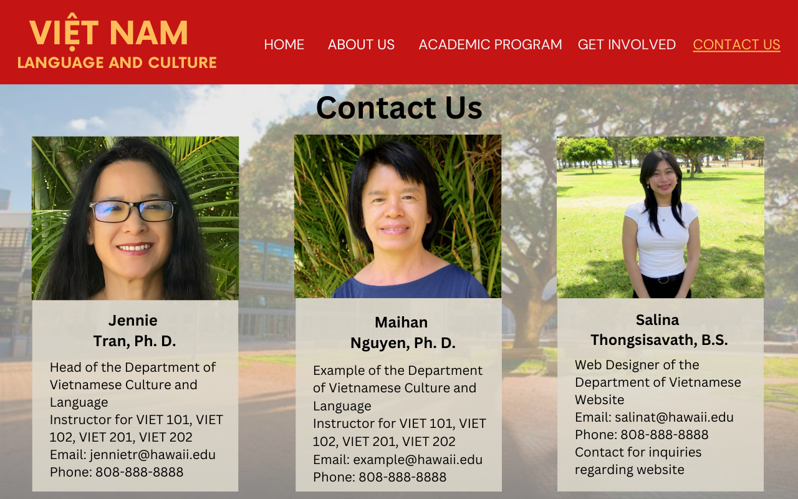

## About the Project

This project is an ongoing project I am working on to create a website for the UH Manoa Vietnamese Program. This is a solo project that I designed and am currently working on developing.

My passion for both web development and Vietnamese culture has inspired me to take this opportunity to work alongside Dr. Jennie Tran to create a platform that will enhance the visibility of the Vietnamese Program at UH Manoa.

In addition to designing and developing the website, I also hold the role of both president and founder of the UH Manoa Vietnamesse club. My involvement in the Vietnamese community has allowed me to gain insights into the needs of students and faculty within the program, which has helped me create a website that meets those needs while reflecting the program's values.

## Objective 

The objective of this project is transform the outdated Vietnamese Webpage into an engaging platform that captures the interest of students. Currently, the existing site lacks visibility and lacks modern design that will help engage students effectively. The newly designed website will serve as a platform for students to learn more about the program, its faculty, academic programs, and extracurricular activities, encouraging new students to join and expand the exposure of the program. Here is a look at the current Vietnamese Program website:

## UX/UI Design

The design of the website is inspired by Vietnamese culture and values. Featuring a vibrant color scheme of red and yellow, which reflect the Vietnamese flag, the layout is clean and user-friendly. The homepage will showcase captivating images representing Vietnamese culture, such as the Áo Dài (traditional Vietnamese dress), Phở, and the Trâu Nước (water buffalo). Key sections will include information about faculty, academic programs, events, and contact details. Here is my proposed design for the landing page:

## Development

For the development of this website, I am utilizing HTML, CSS, and JavaScript. Using React, I am creating a responsive front-end layout that will enhance user interaction. The website will be structured for easy navigation, ensuring that students and faculty can access essential information effortlessly. On the backend, Node.js will handle requests and responses, ensuring smooth functionality. The site will be hosted on the UH Manoa server, making it easily accessible to the university community.

## Working with Dr. Jennie Tran

I have the privilege of working alongside Dr. Jennie Tran, who is the head of the Vietnamese Program at UH Manoa. Dr. Tran has provided me with valuable feedback throughout the design and development process. She has shared insights into the needs of students and faculty within the program, which has helped me tailor the website to meet those needs while reflecting the program's values. Collaborating with Dr. Tran has been a fulfilling experience, and I am grateful for the opportunity to collaborate with her on this project.

### Sample of the Website

### Learn More

You can learn more about the UH Manoa Vietnamese Program by visiting the [UH Manoa Vietnamese Program website](https://manoa.hawaii.edu/ipll/academic-programs/vietnamese/). Please keep in mind that this project is ongoing and may not be fully completed at the time of your visit.

