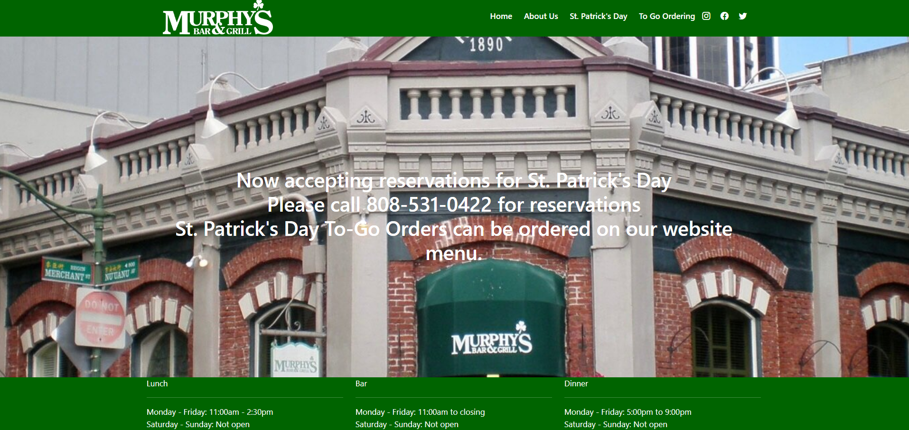

This page showcases replicas of websites I have created using HTML, CSS, JavaScript, Bootstrap, and React. These replicas demonstrate my skills in web development and design and were created to practice creating visually appealing websites with different styles and aesthetics. 

Experimenting with different designs and layouts has helped me understand the importance of creating aesthetic websites that are user-friendly and engaging. These replicas have also helped me practice my skills in web development and design, such as creating responsive layouts, using CSS animations, and integrating JavaScript tools.

## Daily Whisk Website Replica

At the time of this project, I was learning web development and design. I also discovered my liking to matcha, so to practice my skills, I created a replica of the Daily Whisk website using HTML, CSS, JavaScript, Bootstrap, and React. The website features a homepage, menu, about us, and contact us page. The website is designed to be visually appealing and a template for a real website--as I was just practcing creating visual designs and layouts and not the actual content.

## Buzz's Original Steak House Website Replica

I was assigned to create a replica of the Buzz's Original Steak House website when I was taking my Software development course (ICS 314). This time, I created this website replica with pure HTML, CSS, JavaScript. Similarly to the Daily Whisk replica, this website was designed to exercise my skills in web development and help me get a better understanding of how to create visually appealing websites.

## Murphy's Bar & Grill Website Replica

